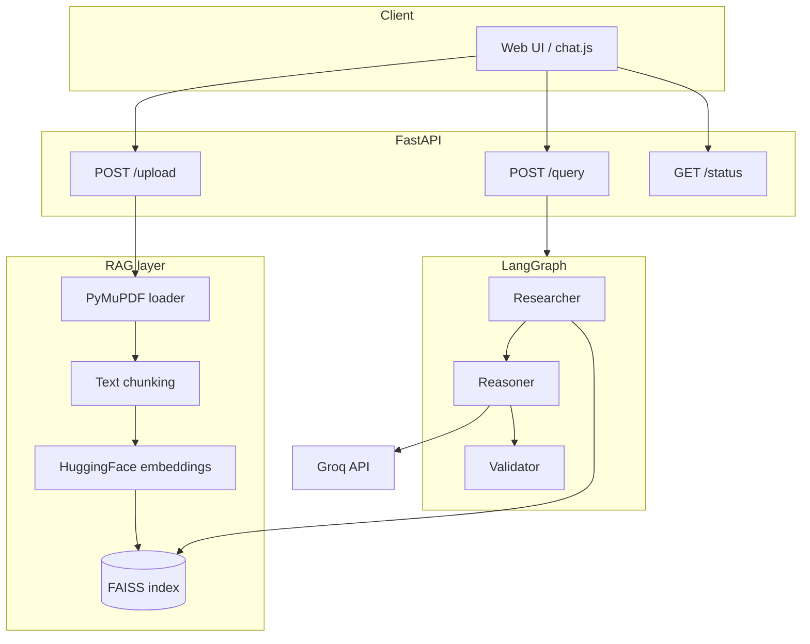

# RAG Document Q&A Chatbot

A **Retrieval-Augmented Generation (RAG)** application that lets you chat with your PDF documents. Upload a book or report, ask questions in natural language, and get answers grounded in retrieved passages—orchestrated with **LangGraph**, served by **FastAPI**, and powered by **Groq** for generation.


---

## Features

- **PDF ingestion** — Load documents from `data/` or upload via the web UI
- **Vector search** — FAISS index with local `sentence-transformers` embeddings
- **Grounded answers** — LLM responds only from retrieved context
- **LangGraph pipeline** — Research → Reason → Validate workflow
- **Background indexing** — Server starts immediately; first-time embedding runs in a background thread
- **Conversation history** — Follow-up questions include recent turns in the prompt
- **Source citations** — Answers include document name, page, and excerpt in the UI and API
- **Docker support** — Run with `docker compose up`
- **Automated tests** — pytest suite with GitHub Actions CI

---

## Architecture



| Step | Component | Description |
|------|-----------|-------------|
| 1 | **Indexer** | PDFs under `data/` are chunked and embedded into `data/faiss_index/` |
| 2 | **Researcher** | Top-6 similar chunks retrieved for the user query |
| 3 | **Reasoner** | Groq LLM generates an answer from the top 5 unique chunks |
| 4 | **Validator** | Checks retrieval and answer quality; returns the final response |

---

## Tech stack

| Layer | Technology |
|-------|------------|
| API | [FastAPI](https://fastapi.tiangolo.com/), [Uvicorn](https://www.uvicorn.org/) |
| Orchestration | [LangGraph](https://langchain-ai.github.io/langgraph/) |
| RAG | [LangChain Community](https://python.langchain.com/), FAISS, HuggingFace embeddings |
| LLM | [Groq](https://groq.com/) (`llama-3.3-70b-versatile` by default) |
| PDF parsing | [PyMuPDF](https://pymupdf.readthedocs.io/) |
| Embeddings | `sentence-transformers/all-MiniLM-L6-v2` |

---

## Project structure

```
RAG-based-chatbot/
├── app/
│   ├── agents/           # LangGraph nodes
│   │   ├── researcher.py
│   │   ├── reasoner.py
│   │   └── validator.py
│   ├── graph/
│   │   └── workflow.py   # LangGraph definition
│   ├── rag/
│   │   ├── loaders.py    # PDF discovery & extraction
│   │   ├── ingestion.py  # Text splitting
│   │   ├── vector_store.py
│   │   ├── index_builder.py
│   │   └── citations.py
│   ├── schemas/
│   │   └── state.py      # Shared graph state
│   ├── tools/
│   │   ├── llm.py        # Groq client
│   │   └── embeddings.py
│   ├── static/           # Frontend (HTML, JS)
│   └── main.py           # FastAPI app
├── data/
│   ├── uploads/          # Uploaded PDFs
│   └── faiss_index/      # Persisted vector store (gitignored)
├── tests/                # pytest suite
├── Dockerfile
├── docker-compose.yml
├── pytest.ini
├── requirements.txt
├── .env                  # API keys (create locally, not committed)
└── README.md
```

---

## Prerequisites

- **Python 3.12** (recommended; 3.11 may work)
- **Groq API key** — [Get one free](https://console.groq.com/keys)
- ~2 GB disk space for dependencies and embedding models (first run downloads models)

---

## Setup

### 1. Clone and enter the project

```bash
git clone <your-repo-url>
cd RAG-based-chatbot
```

### 2. Create a virtual environment

```bash
python3.12 -m venv venv
source venv/bin/activate        # Windows: venv\Scripts\activate
```

### 3. Install dependencies

```bash
pip install -U pip setuptools wheel
pip install -r requirements.txt
```

> **macOS note:** `faiss-cpu` is pinned to `1.10.0` for prebuilt wheels. If install fails, use `pip install faiss-cpu==1.10.0 --only-binary faiss-cpu`.

### 4. Configure environment variables

Create a `.env` file in the project root:

```env
GROQ_API_KEY=your_groq_api_key_here

# Optional — defaults to llama-3.3-70b-versatile
# GROQ_MODEL=llama-3.3-70b-versatile
```

### 5. Add a document (optional)

Place PDF files anywhere under `data/`, for example:

```text
data/uploads/my-book.pdf
```

On first startup, the app builds a FAISS index in the background. You can also upload PDFs from the UI after the server is running.

---

## Running the app

From the project root, with the venv activated:

```bash
python -m uvicorn app.main:app --host 127.0.0.1 --port 8000
```

For development with auto-reload (exclude `data/` so index writes do not restart the server):

```bash
python -m uvicorn app.main:app --reload --reload-exclude 'data/*' --host 127.0.0.1 --port 8000
```

Open in your browser:

- **Chat UI:** http://127.0.0.1:8000/
- **API docs:** http://127.0.0.1:8000/docs

Wait until the terminal shows `✅ FAISS index ready` or the UI status banner clears before asking questions. The first index build for a large PDF can take **several minutes** on CPU.

---

## API reference

### `GET /status`

Index readiness for the frontend.

```json
{ "ready": true, "building": false, "error": null }
```

### `POST /query`

Ask a question about the indexed documents.

**Request:**

```json
{
  "query": "What is the main idea of chapter one?",
  "conversation": []
}
```

**Response:**

```json
{
  "answer": "...",
  "conversation": [{ "user": "...", "bot": "..." }],
  "sources": [
    {
      "id": 1,
      "source": "book.pdf",
      "page": 12,
      "excerpt": "Relevant passage from the document…"
    }
  ]
}
```

### `POST /upload`

Upload a PDF (multipart form, field name `file`). Chunks are added to the existing index.

---

## Docker (local)

```bash
# Ensure .env contains GROQ_API_KEY
docker compose up --build
```

Open http://127.0.0.1:8000/. The `data/` folder is mounted as a volume so the FAISS index persists between restarts.

## Deploy on Render

Production deploy uses the included `render.yaml` blueprint and Docker image.

1. Push the repo to GitHub.
2. Render → **New Blueprint** → connect repo → set `GROQ_API_KEY`.
3. Use **Starter plan** or higher (ML dependencies need more than 512MB RAM).

Full steps, disk setup, and troubleshooting: **[docs/DEPLOY_RENDER.md](docs/DEPLOY_RENDER.md)**.

Health check: `GET /health` — index status: `GET /status`.

---

## Tests

```bash
pip install -r requirements.txt
SKIP_INDEX_BUILD=1 pytest -q
```

CI runs the same tests on push via GitHub Actions (`.github/workflows/ci.yml`).

---

## Rebuilding the index

If you change PDFs or update the ingestion code, delete the saved index and restart:

```bash
rm -rf data/faiss_index
python -m uvicorn app.main:app --host 127.0.0.1 --port 8000
```

---

## Troubleshooting

| Issue | Fix |
|-------|-----|
| `ModuleNotFoundError: langgraph` | Activate venv and run `pip install -r requirements.txt` |
| Wrong Python / missing packages | Use `python -m uvicorn`, not a global `uvicorn` binary |
| `Invalid API Key` | Set a valid `GROQ_API_KEY` in `.env` and restart |
| Page loads forever on startup | First-time embedding is slow; check `/status` or terminal logs |
| Same generic answer every time | Rebuild index (`rm -rf data/faiss_index`); verify Groq key |
| NumPy / PyTorch errors | Use pinned versions in `requirements.txt`; use Python 3.12 venv only |

---

## Limitations

- **PDF only** — No DOCX, web pages, or images
- **Local FAISS** — Single-machine store; not suited for multi-user production as-is
- **CPU embeddings** — Large books are slow to index without a GPU
- **English-focused** — No explicit multilingual handling

---

## License

This project is provided for educational and portfolio use. Add your chosen license before public distribution.

---

## Author

Built as a portfolio project demonstrating RAG, LangGraph, and FastAPI. Replace this section with your name, LinkedIn, and demo link when publishing.
